<!-- Generated by pdf2md.py | source: aof-ud-02.pdf -->

## En esta unidad aprenderemos a…

### •
### Personalizar las opciones de un procesador de textos.
### •
### Añadir portadas, encabezados, índices y referencias a un documento.

### •
### Diseñar plantillas, formularios y macros…
### •
### Convertir documentos entre distintos formatos.
### •
### Configurar la página con márgenes, tabulaciones y columnas.

2

## Y también estudiaremos…

### •
### Las herramientas de formato: estilos y temas.
### •
### La creación de distintos tipos de documentos y plantillas.

### •
### La importación y exportación de documentos.
### •
### Las herramientas de seguridad, revisión y trabajo en equipo.
### •
### La inserción de tablas, texto, imágenes y otros objetos.
### •
### La combinación de correspondencia.

3

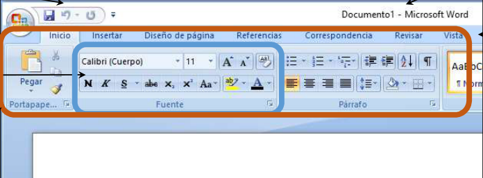 Barra de título Grupos de opciones

Fichas Barra de herramientas

de acceso rápido

 4

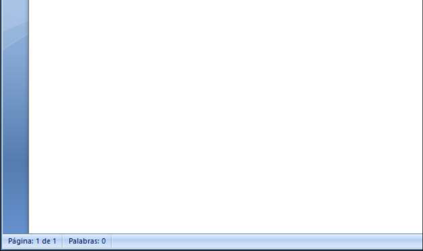 Cinta de opciones

Barra de estados

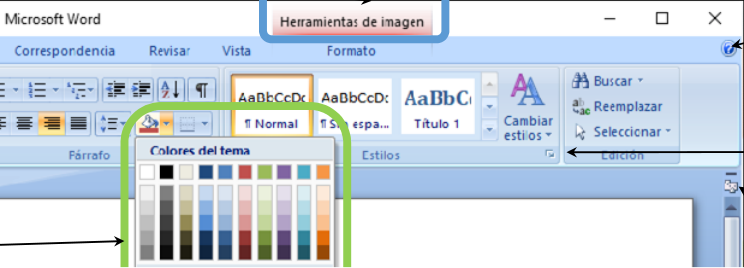 Ficha contextual

Ayuda

Indicador de cuadro de diálogo

Menú desplegable

M t lt

 5

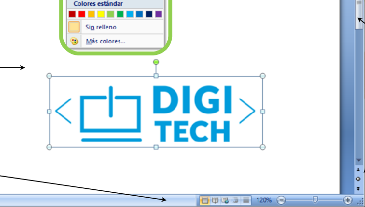 Área de trabajo Barra de desplazamiento

Barra de estados

Mostrar u ocultar

regla

Ficha Inicio

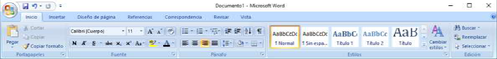
 6

En la ficha Inicio se incluyen las herramientas más utilizadas: las de formato de fuente y párrafo. También se agrupan los distintos estilos, así como las utilidades básicas (copiar, pegar, buscar y reemplazar)..

Ficha Insertar

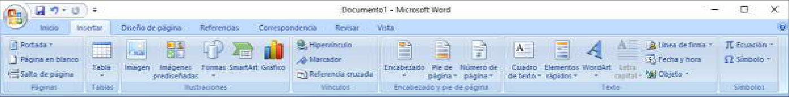
 7

Ofrece opciones para incluir objetos en nuestro documento: fotografías, dibujos, tablas, ecuaciones matemáticas o incluso otros archivos. También se encuentran aquí algunas opciones de organización del documento, como encabezados y pies de página, numeración, portada o división en secciones.

Ficha Diseño de página

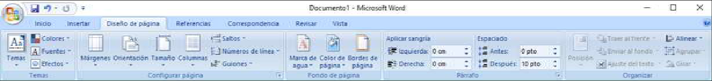
 8

Desde aquí se puede configurar el espacio en el que escribimos: tamaño del papel, orientación, márgenes, fondos y bordes de página, organización del texto en columnas, etc. También se puede seleccionar y personalizar el tema, que fija los colores y fuentes utilizados en el documento.

Ficha Referencias

 9

Permite establecer enlaces entre distintas partes del mismo documento: el índice de contenidos, por ejemplo, se actualizará automáticamente aunque los epígrafes cambien de una página a otra. También se pueden insertar notas al pie, tablas de figuras o referencias bibliográficas.

 Ficha Correspondencia

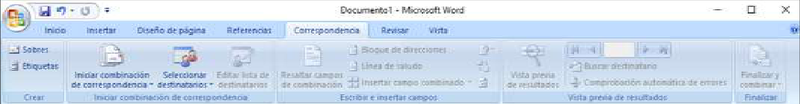
 10

Esta ficha da soporte a la generación semiautomática de cartas, sobres y etiquetas de direcciones.

Ficha Revisar

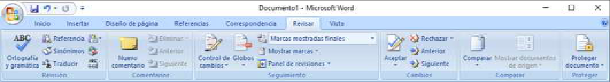
 11

Agrupa las opciones relativas a corrección ortográfica y traducción, pero también las herramientas para edición en grupo, a través de comentarios y propuestas de cambios.

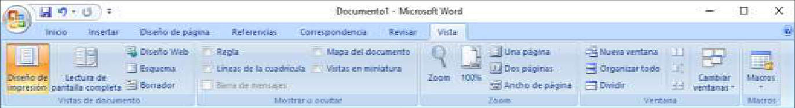 Ficha Vista

 12

 Permite configurar el área de trabajo (zoom, regla, vista de impresión o de borrador, etc.). Muchas de estas opciones son también accesibles desde la barra de estado.

El formato es el conjunto de características del texto que le otorgan

un determinado aspecto.

El formato determina la presentación final del texto y abarca desde el tipo de letra hasta el espaciado entre líneas, pasando por los

 13

p p , p p colores utilizados o la anchura de los márgenes.

Word ofrece una serie de herramientas para personalizar el formato de los documentos, pero también incorpora los conceptos de tema y estilos para simplificar la aplicación de un formato determinado: en este apartado estudiaremos todas estas técnicas.

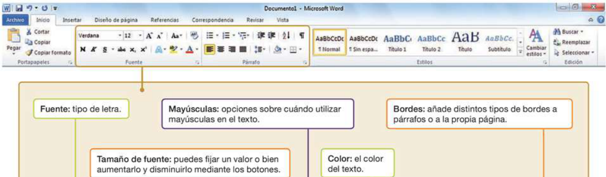
 14

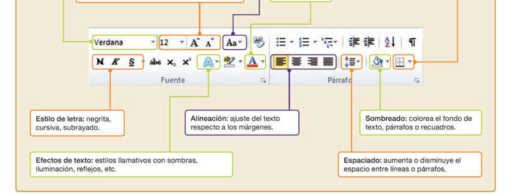
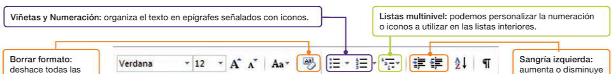
 15

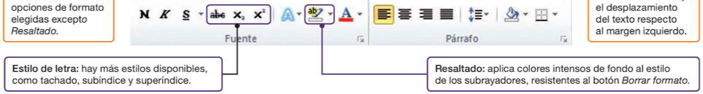
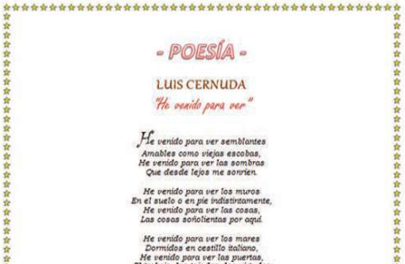 En el Campus:

1. Descarga el documento “Poesía.docx”.

1 Descarga el documento “Paso a

 16

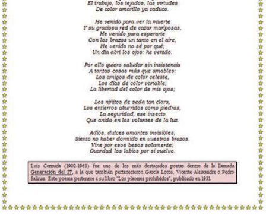 1. Descarga el documento Paso a paso.pdf”

1. Realiza la actividad siguiendo los pasos
indicados.

La sangría consiste en empezar el renglón a una distancia del margen mayor que el resto del párrafo. Generalmente sobre el margen izquierdo. Cuando hacemos clic en el botón Sangría izquierda, todo el párrafo se desplazará hacia la derecha.

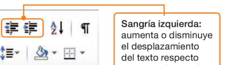
 17

Las viñetas y listas Se usan para enumerar distintos elementos. Word ofrece dos tipos básicos de listas: numeradas y sin numerar.

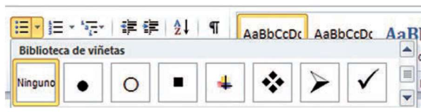
 Lista multinivel: Mediante el menú desplegable de este botón podemos personalizar el esquema de numeración, viñetas o combinación de ambos para este tipo de listas.

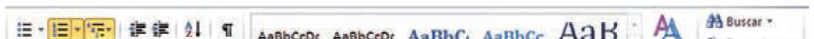
 18

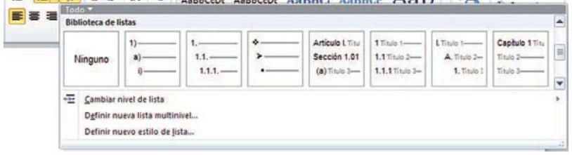 Autoformato: Para simplificar nuestro trabajo, Word intenta anticipar el formato que queremos encada momento. Si, por ejemplo, escribimos el número 1 seguido de un punto, Word comenzará una lista numerada, o si escribimos un guión, comenzará una lista de viñetas. Pero si no estamos de acuerdo con el cambio, Word nos da la opción de rectificar a través del icono en forma de rayo que aparece momentáneamente en pantalla

 19

El autoformato no solo afecta a las listas: también transforma, por ejemplo, direcciones web o de correo electrónico en vínculos, otorgándoles el aspecto habitual de los enlaces en Internet, subrayado y con color de fuente azul. En estos casos, la opción de deshacer el autoformato no aparece automáticamente: es necesario situar el puntero del ratón en la primera letra del enlace.

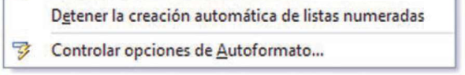
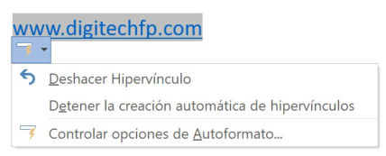
### Las herramientas de formato que hemos estudiado permiten dar a nuestro
### texto
### un
### acabado
### más
### profesional,
### pero
### cuando
### trabajamos
### con
### documentos largos pueden resultar poco prácticas.

### Por ello, Word ofrece dos conceptos complementarios: TEMAS y ESTILOS.

 20

### La idea es la misma: aplicar formato al documento de forma sencilla con
### ciertas combinaciones de fuentes, colores y decoraciones de texto para
### alcanzar un aspecto más atractivo en nuestros trabajos. Pero de una forma
### más automática.

### Un estilo en Word es un conjunto predeterminado de características de
### formato, identificable por un nombre (por ejemplo, «Título 2» o «Párrafo de
### lista») que se encuentra disponible en el grupo Estilos de la ficha Inicio:

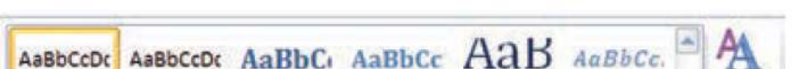
 21

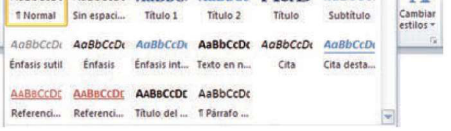
### Los estilos del menú están relacionados entre sí: Word los agrupa en
### Conjuntos de estilos para garantizar que siguen la misma estética. Podemos
### elegir entre más de diez conjuntos de estilos diferentes a través del botón
### Cambiar estilos:

 22

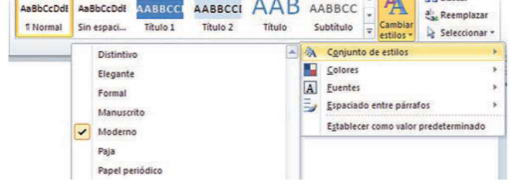 Al igual que el estilo, un tema en Office es un conjunto predeterminado de características de formato identificables por un nombre (por ejemplo, «Ejecutivo»). Sin embargo, existen diferencias entre temas, estilos y conjuntos de estilos:

• El tema y el conjunto de estilos se aplican a todo el documento, mientras que el estilo se aplica solo a un determinado fragmento del texto. En un documento conviven distintos estilos (títulos, listas, etc.), pero solo puede haber un tema y un conjunto de estilos.

 23

• El tema está disponible en otras aplicaciones de Office, lo que permite aplicar el mismo aspecto visual a distintos tipos de documentos: una hoja de cálculo, un formulario de una base de datos, una presentación multimedia, etc.

• El tema se puede escoger en la ficha Diseño de página de la cinta de opciones. Si no te satisfacen los temas predeterminados, puedes modificar las tres características de formato que componen el tema a través de los botones Colores, Fuentes y Efectos.

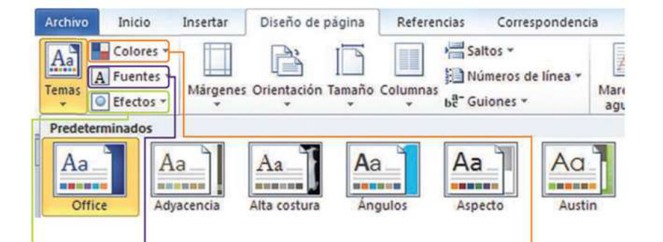
 24

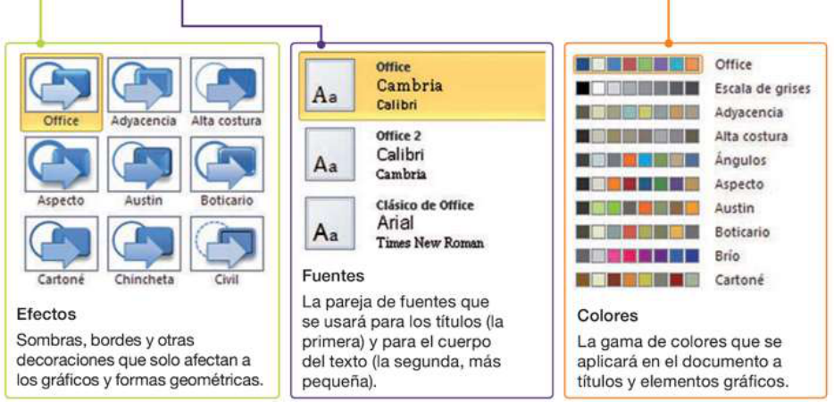 La ficha Insertar de Word nos permite añadir distintos tipos de elementos a nuestro documento. Muchas de las opciones de esta ficha son comunes a las demás aplicaciones de Office, en este apartado nos centraremos en la inserción de texto, imágenes y símbolos.

 25

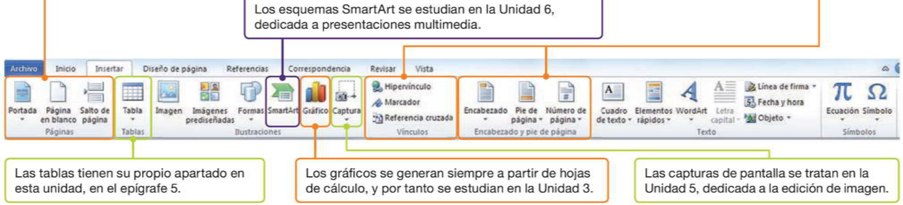
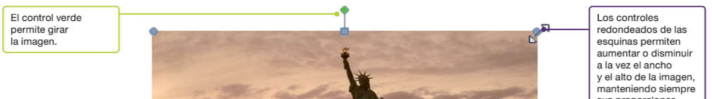 Para insertar una imagen en un documento de Word debemos hacer clic en el botón Imagen en el grupo Ilustraciones.

 26

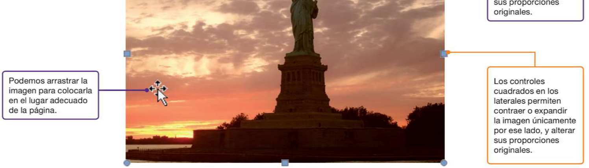 HERRAMIENTAS DE IMAGEN

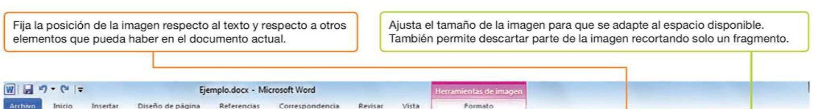
 27

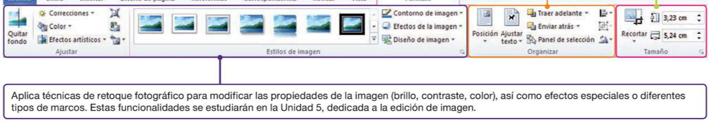 FORMAS

Es posible incluir un dibujo en Word a través del botón Formas. En el menú desplegable podemos escoger entre multitud de dibujos, algunos muy básicos y otros más elaborados.

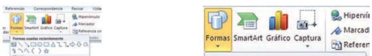 Hacemos clic en el punto del

 28

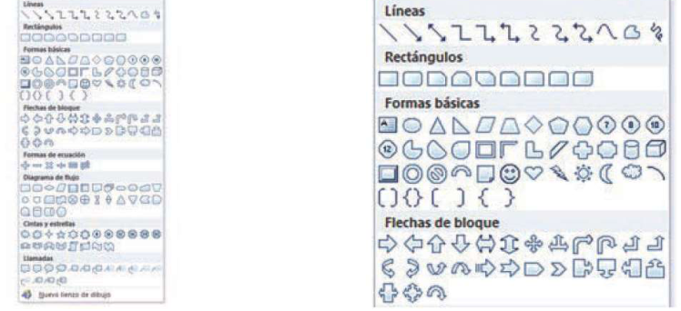 Hacemos clic en el punto del documento en el que queremos incluirla, y a continuación arrastrar el ratón en la dirección deseada para dar forma y tamaño al dibujo.

DIBUJOS

Una vez se encuentra en el documento, podemos hacer clic sobre el dibujo y aparecerá una ficha contextual muy parecida a la que vimos en el caso de las imágenes: en este caso se llama Herramientas de dibujo.

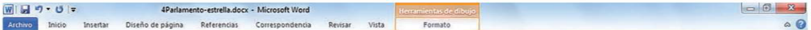
 29

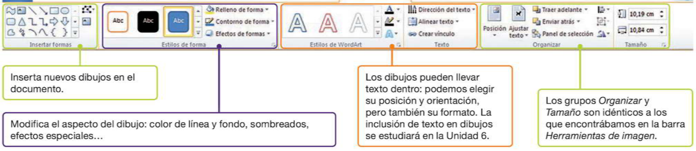 IMÁGENES PREDISEÑADAS

Al pulsar en el botón Imágenes prediseñadas aparece una barra lateral en la que se puede buscar cualquier concepto («animal», «trabajo», «oficina», etc.). La galería es aún más amplia si permitimos al programa conectarse a la web de Office para buscar más contenidos.

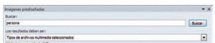
 30

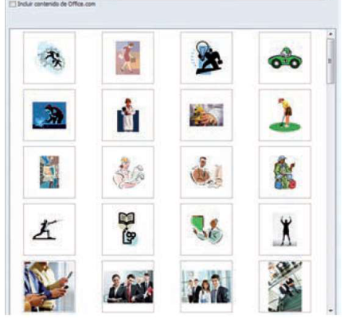 A. INSERCIÓN DE SÍMBOLOS Y ECUACIONES

En la ficha Insertar, nos encontramos con la posibilidad de incluir símbolos en el texto. Normalmente se trata de símbolos que no se encuentran en el teclado, caracteres de otros idiomas o símbolos gráficos.

El menú Ecuación permite representar fórmulas complejas combinando los

 31

p p p j símbolos con un potente editor de fórmulas.

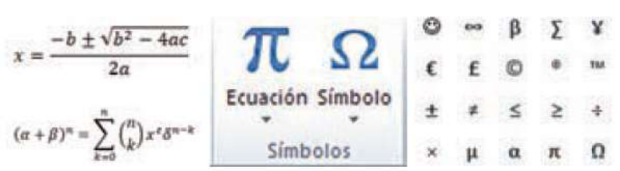 B. INSERCIÓN DE TEXTO

El elemento de inserción de texto más utilizado es el Cuadro de texto. En realidad se trata de una forma geométrica más (recordemos que todas las formas pueden llevar texto en su interior); pero debido a su uso más frecuente, se incluye también en la ficha Insertar.

 32

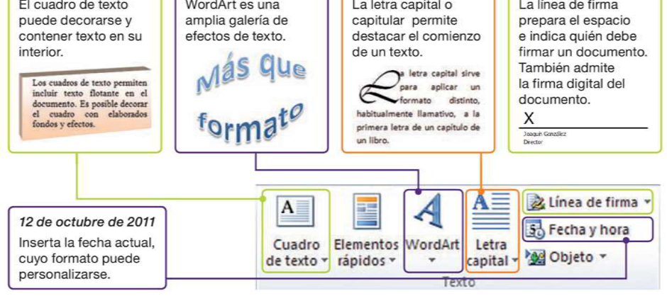 La tabla es una forma de estructurar datos en filas y columnas: la información se almacena en los recuadros generados por la intersección de filas y columnas, llamados celdas.

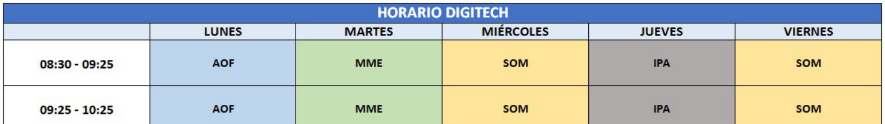
 33

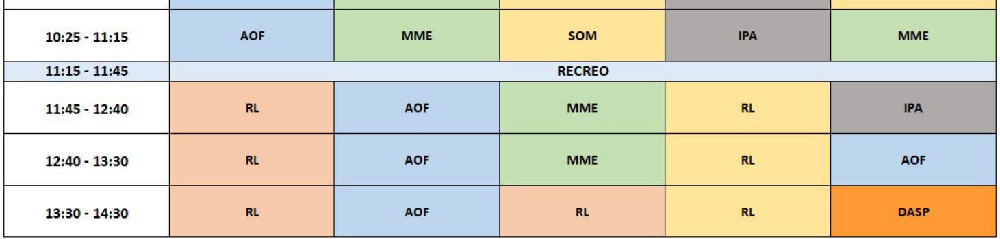
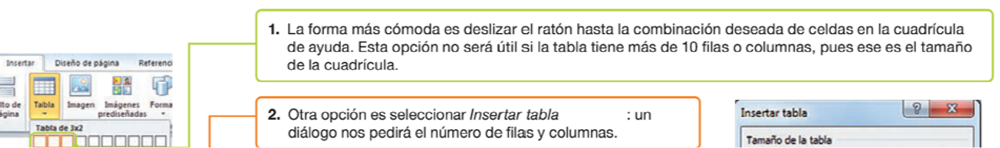
 34

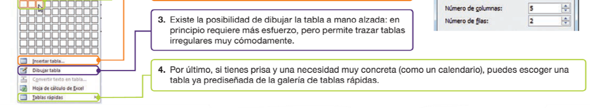
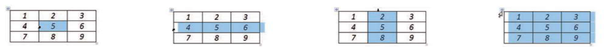
 35

Para seleccionar una celda, sitúate con el ratón en su parte izquierda y haz clic.

Para seleccionar una fila, dirígete a la primera celda de la fi la y haz doble clic.

Para seleccionar una columna, sitúate en la parte superior y haz clic.

Para seleccionar toda la tabla, pulsa sobre el icono en forma de cruz que hay en la esquina.

Cuando seleccionamos una tabla aparece una ficha contextual: Herramientas de tabla. Ésta contiene a su vez dos fichas internas: Diseño y Presentación.

Examinemos primero la ficha de diseño:

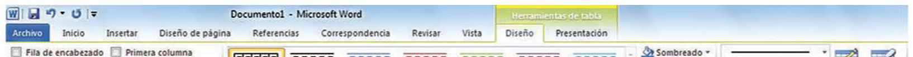
 36

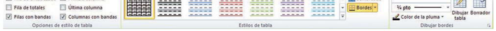
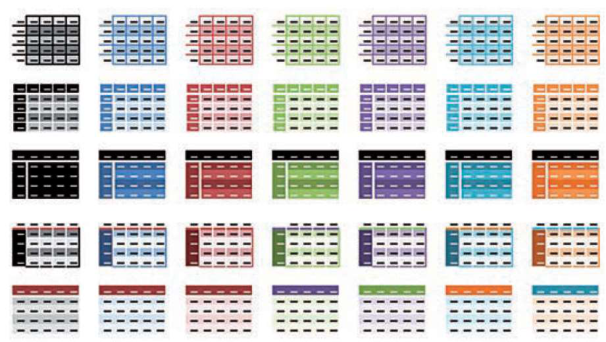 Examinemos ahora la ficha de presentación:

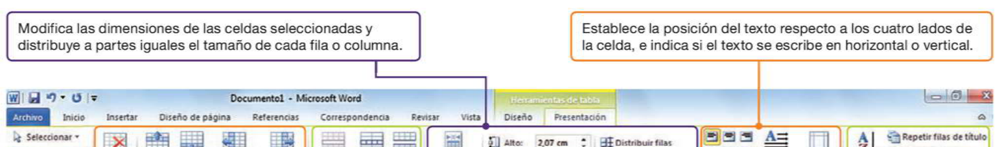
 37

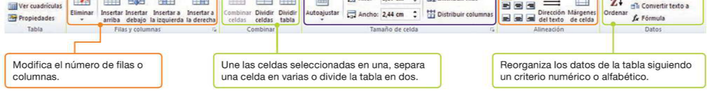 Las portadas, los índices de contenido, los encabezados, etc. aportan elegancia y facilitan una rápida comprensión de cómo está organizado el documento.

Word presenta una amplia gama de herramientas que permiten mejorar la organización y estructura del documento, y hacerlo más atractivo para el lector final.

Estas herramientas se distribuyen entre las fichas Insertar Diseño de página y

 38

Estas herramientas se distribuyen entre las fichas Insertar, Diseño de página y Referencias.

 El primer elemento que mejora la presentación de un documento es la portada.

Se utiliza para presentar trabajos escolares, memorias o propuestas d t d t d l

 39

de proyectos dentro de la empresa, etc.

Evidentemente, no necesitamos una herramienta específica. Sin embargo, la galería de portadas de Word nos facilita enormemente la tarea.

 En la ficha Diseño de página tenemos opciones relativas a configuración de página, como la orientación (vertical o apaisada), el tamaño de la hoja, los márgenes y la organización en columnas.

 40

 A. Saltos

• El salto de página es una señal invisible que dejamos en el documento para indicar que deseamos dejar el resto de la página en blanco.

 41

• El salto de sección está pensado para distinguir capítulos o apartados en un documento largo. La ventaja es que los encabezados y pies podrán ser diferentes para cada sección, puede cambiar la orientación (vertical u horizontal), etc.

 B. Herramientas de encabezado y pie de página

 42

 Word nos permite realizar índices de manera automática, lo que facilita mucho la tarea en documentos con varios apartados, pudiendo indicar la página de cada uno de ellos.

 43

 https://www.tiktok.com/@umbr al_arqui/video/7011386822991 334662?is_from_webapp=1&we b_id=7135924921024693765

• La revisión de un documento ayuda a detectar algunos errores gramaticales y ortográficos cometidos a la hora de redactar un texto.

• Word incorpora un conjunto de herramientas muy potentes para ayudarnos en esta tarea. Podemos además configurarlo para que revise automáticamente el texto según lo escribimos y modifique el texto si detecta alguna incorrección.

 44

Word no siempre es capaz de corregir todas las faltas de ortografía y gramática, por lo que es muy recomendable leer y corregir cualquier documento antes de presentarlo.

 45

 Word lo va revisando el texto según lo escribimos. Si detecta que una palabra no es correcta la subraya con una línea:

▪ Roja (errores de ortografía). ▪ Verde (errores gramaticales). ▪ Azul (palabras correctas pero que no proceden en ese contexto).

 46

Si colocamos el ratón sobre la palabra (o palabras) marcadas y hacemos clic derecho, se abre un menú contextual con opciones de corrección.

 Opciones de autocorrección: Botón de office Opciones de Word Revisión. También podemos modificar aquí las opciones de autocorrección.

 47

 EJERCICIO:

Descarga del campus virtual el archivo de Word “Ejercicio de revisión ortográfica”, que contiene algunos errores.

Elige la opción Ortografía y Gramática en la ficha Revisar para repasar los errores gramaticales y ortográficos del texto.

 48

g y g

 Una macro es un conjunto de órdenes que se ejecutan como si fuesen una sola.

En Office, las macros se asocian a botones de la cinta de opciones, o bien a

combinaciones de teclado.

ACTIVACIÓN DE LAS MACROS:

 49

 PESTAÑA PROGRAMADOR:

Haremos un clic derecho sobre una zona gris de la cinta de opciones y después clic izquierdo sobre “Personalizar la cinta de opciones…”.

 50

 Clic sobre la casilla “Programador” y después clic sobre el botón “Aceptar”.

 INICIAR LA GRABACIÓN DE UNA MACRO:

Clic sobre la ficha Programador y después clic sobre el botón “Grabar macro”.

 51

 En el siguiente cuadro contextual, en el apartado “Nombre de macro” le asignaremos un nombre a la macro.

En el apartado “Guardar macro en” lo dejaremos en “Todos los documentos (Normal.dotm)”.

 INICIAR LA GRABACIÓN DE UNA MACRO:

A continuación podremos escoger entre vincular la macro con un atajo de teclado o un botón:

 52

 REALIZAR LAS OPERACIONES DE LA MACRO Y FINALIZAR LA GRABACIÓN:

Ya podemos empezar a realizar las operaciones de la macro, el puntero adoptará la forma de grabadora.

 53

Una vez que hayamos realizado todas las operaciones, para finalizar la grabación clic sobre el botón “Detener grabación”.

 54

 Vamos a trabajar de manera colaborativa en la nube utilizando Microsoft Word (o Google Docs). Cada miembro del grupo será responsable de una tarea específica para crear un documento coherente y bien estructurado:

1.Crear un Documento Compartido:

Uno de los miembros del grupo debe iniciar un documento en Microsoft Word 365 o Google Docs. 2.Portada (Estudiante 1):

El Estudiante 1 será responsable de crear una portada atractiva para el documento. Incluye el título del d l b d l l f h

 55

documento, los nombres de los participantes y la fecha. 3.Tabla (Estudiante 2):

El Estudiante 2 debe insertar una tabla en una sección del documento. La tabla debe tener al menos tres filas y tres columnas. Pueden ser filas y columnas para datos ficticios relacionados con el tema del documento. 4.Insertar Imágenes (Estudiante 3):

El Estudiante 3 se encargará de buscar e insertar al menos tres imágenes relevantes al tema del documento. Asegúrate de que las imágenes estén bien ubicadas y tengan títulos descriptivos. 5.Índice (Estudiante 4):

El Estudiante 4 debe crear un índice para el documento. Incluye al menos tres secciones (Portada, Tabla, Imágenes) y asegúrate de que los enlaces funcionen correctamente.

