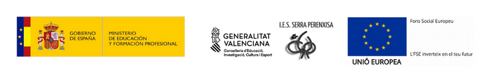

### Aplicaciones Ofimáticas

# UD 01. Introducción a aplicaciones ofimáticas

{ .center width="900" }
{ width="320" }

### Autores: <u>Sergi García Barea</u>, <u>Gloria Muñoz González</u>
{ width="180" }

Actualizado Septiembre 2022

### Licencia

> [!CAUTION]**Reconocimiento - No comercial - CompartirIgual** (BY-NC-SA): No se permite un uso comercial de la obra original ni de las posibles obras derivadas, la distribución de las cuales se ha de hacer con una licencia igual a la que regula la obra original.

### Nomenclatura

A lo largo de este tema se utilizarán diferentes símbolos para distinguir elementos importantes dentro del contenido. Estos símbolos son:

> [!TIP]
> 📖 **Importante**

> [!TIP]
>❕ **Atención**

> [!TIP]
> 💬 **Interesante**

> [!TIP]
> 📕 **A entregar**

----

<b>Índice de contenido</b>

[**Fecha de entrega**](#fecha-de-entrega)

[**Observaciones previas a la realización de tareas evaluables**](#observaciones-previas-a-la-realización-de-tareas-evaluables)

[**Actividad 01**](#actividad-01)

[**Actividad 02**](#actividad-02)

[**Actividad 03**](#actividad-03)

[**Actividad 04**](#actividad-04)

[**Actividad 05**](#actividad-05)

[**Actividad 06**](#actividad-06)

[**Actividad 07**](#actividad-07)

[**Actividad 08**](#actividad-08)

[**Actividad 09**](#actividad-09) **3 3 3 3 3 4 4 4 4 4 4**

----

# UD 01. Actividades evaluables 01

## Fecha de entrega

**Fecha límite de entrega: Lunes 29 de septiembre a las 23:55.**

La actividad será evaluada cuando haya pasado la fecha límite de la entrega.

❕ **Atención:** la fecha de entrega no es prorrogable. Si no la entregas en tiempo y forma, la calificación de la actividad será 0.

## Observaciones previas a la realización de tareas evaluables

  - > Salvo excepciones que lo indique en cada actividad, deberás generar un único documento para todo el boletín y en ese documento incluir la respuesta a cada actividad.
    
      - > Si para la entrega se requiere entregar varios ficheros, entrégalos comprimido en un único fichero con extensión “.zip”.

  - > Cuando se entreguen documentos, estos deben tener una buena presentación. Aunque el documento a entregar sea pequeño, debe tener portada, índice, cabecera, pie de página (con número de página), además de ser coherente en estilo.
    
      - > El índice solo será necesario si el documento (sin contar portada) ocupa más de una página y tiene más de un apartado.

  - > Las actividades deben realizarse en la lengua indicada en cada actividad. La gramática y la ortografía tenéis que intentar hacerla bien.

❕ **Atención:** no cumplir estas consideraciones puede reducir la nota hasta 3 puntos.

## Actividad 01

Explica en un documento que es una suite ofimática. Al realizar la explicación explica las diferencias entre una suite ofimática local (instalada en tu ordenador) y una suite ofimática en la nube utilizada a través de un navegador.

📕 **A entregar:** texto con la explicación solicitada. Enséñalo a tu profesor antes de entregarlo.

## Actividad 02

Nombra los tipos de aplicaciones ofimáticas que conozcas (esperamos entre 5 y 10). Para cada tipo, indica un ejemplo de aplicación ofimática local y un ejemplo de aplicación en la nube.

📕 **A entregar:** texto con tipos y ejemplos solicitados.

## Actividad 03

Nombra al menos 3 suites ofimáticas que conozcas (al menos 1 en la nube y al menos 1 local). De cada una, indica qué tipos de aplicaciones ofimáticas posee.

📕 **A entregar:** texto con nombre de suites y tipos de aplicaciones que poseen.

## Actividad 04

¿Qué peligros tiene el utilizar aplicaciones ofimáticas en la nube? ¿Son seguras? ¿Con qué tipo de documentos ***NUNCA*** deberíamos utilizarlas?

📕 **A entregar:** texto respondiendo a las preguntas solicitadas. Enséñalo a tu profesor antes de entregarlo.

## Actividad 05

Visualiza el siguiente video sobre ergonomía aplicada a ordenadores de sobremesa y ordenadores portátiles. [https://www.youtube.com/watch?v=e-3\_rKmsjmQ](https://www.youtube.com/watch?v=e-3_rKmsjmQ)

Resume los consejos de ergonomía que nos da este video.

📕 **A entregar:** texto resumiendo los consejos del video.

## Actividad 06

Investiga en Internet consejos de ergonomía aplicados en concreto al uso de smartphones/tablets. Resume los consejos que encuentres.

📕 **A entregar:** texto resumiendo los consejos encontrados. Enséñalo a tu profesor antes de entregarlo.

## Actividad 07

Investiga en Internet consejos para evitar tanto fatiga visual como mental en el uso de pantallas de visualización de datos (sobremesa, portátil y smartphone/tablet”). Resume lo encontrado.

📕 **A entregar:** texto resumiendo los consejos encontrados. Enséñalo a tu profesor antes de entregarlo.

## Actividad 08

¿Qué es una "Cheat sheet?” ¿Cuál sería la traducción al castellano de este término? Explica el sentido de la traducción. Proporciónanos el enlace de “Cheat sheets” que encuentres relacionadas con ofimática, proporcionando al menos 2 en castellano y 2 en inglés.

📕 **A entregar:** definición del término, traducción y enlaces solicitados.

## Actividad 09

Vamos a utilizar la información depositada en estas 3 “Cheat Sheets” de búsqueda de contenidos en Google

  - > [GoogleGuide making searching even easier](https://www.googleguide.com/print/adv_op_ref.pdf)
  - > [https://sites.google.com/site/gwebsearcheducation/goodies](https://sites.google.com/site/gwebsearcheducation/goodies)

          
  - > [Better searches. Better results.](https://static.googleusercontent.com/media/www.google.com/en//educators/downloads/Tips_Tricks_85x11.pdf)

Utilizando estas “Cheat sheets” responde a las siguientes preguntas:

  - > ¿Cómo podríamos buscar ficheros PDF sobre revistas de institutos de secundaria?
    
      - > Truco: al buscar puedes usar el acrónimo “IES”.

  - > ¿Cómo podríamos hacer una búsqueda solo en la web del “IES Serra Perenxisa� [https://mestreacasa.gva.es/web/iesserraperenxisa](https://mestreacasa.gva.es/web/iesserraperenxisa)

  - > ¿Cómo podríamos buscar un texto literal completo (no palabras sueltas) que esté en una web actualizada entre 2019 y 2021?

  - > ¿Qué webs han enlazado al sitio web [www.meneame.net](http://www.meneame.net/), que no sean el propio [www.meneame.net](http://www.meneame.net/)?

📕 **A entregar:** cadenas de búsqueda utilizadas en [www.google.com](http://www.google.com/) para las preguntas solicitadas.
