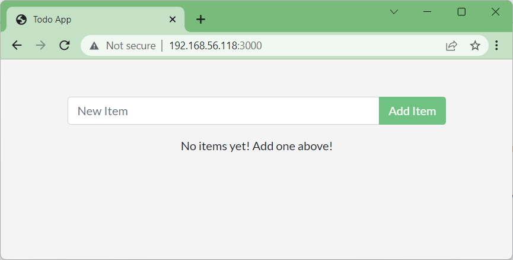

# Creació de la nostra aplicació dins d'un contenidor **`docker`**

<!-- Seguirem el següent enllaç [**Sample application** (docs.docker)](https://docs.docker.com/get-started/02_our_app/) -->

# Índex

## [Teoria de **```Docker```**](#1-teoria-de-docker)

## [Activitat per seguir la teoria](#2-activitat-per-seguir-la-teoria)

## [Activitat de traducció per seguir amb la teoria](##3-activitat-de-traducció-per-seguir-amb-la-teoria)

<!-- ## [**`AcRA1`**: Activitat 1: Contenidor final fet amb de Docker (dilluns 7 d'octubre de 2024 i dimarts 8 d'octubre de 2024)](#4-acra1-activitat-1-contenidor-final-fet-amb-de-docker-dilluns-7-doctubre-de-2024-i-dimarts-8-doctubre-de-2024) -->

<hr>

# 1. Teoria de **```Docker```**

Aquest repositori conté instruccions pas a pas sobre com començar amb **```Docker```**. Algunes de les coses que aprendràs i faràs en aquesta guia són:

1. Creeu i executeu una imatge com a **```contenidor```**.

1. Comparteix imatges amb [**```Docker Hub```**](http://hub.docker.com/) .

1. Desplegueu aplicacions **```Docker```** mitjançant diversos contenidors amb una base de dades.

1. Executeu aplicacions amb **```Docker```** Compose.

Abans d'arribar a les mans d'una part de la guia, hauríeu d'aprendre sobre els contenidors i les imatges.

# Què és un **```contenidor```**?

En poques paraules, un **```contenidor```** és un procés que s'executa a la vostra màquina que està aïllat de tots els altres processos de la màquina **host** (**amfitriona**).

Aquest aïllament aprofita els grups aïllats de processos que s'executen en un únic host, que compleixen un conjunt de característiques "comuns", característiques que han estat a Linux durant molt de temps.

**```Docker```** ha treballat per fer que aquestes capacitats siguin accessibles i fàcils d'utilitzar. En resum, un **```contenidor```**:

* És una instància executable d'una imatge.

* Podeu crear, iniciar, aturar, moure o suprimir un **```contenidor```** mitjançant l'**```API Docker```** o **```Docker CLI```**.

* Es pot executar en màquines locals, màquines virtuals o desplegar-se al núvol.

* És portàtil (es pot executar en qualsevol sistema operatiu).

* Està aïllat d'altres contenidors i executa el seu propi programari, binaris i configuracions.

<hr>

## Comanda per crear un **```contenidor```** amb un nom concret (LaMevaApp-<cognomAlumne>)

> [!TIP]
> ### ***Sintaxi***
> <pre>
> $ docker run [OPTIONS] IMAGE [COMMAND] [ARG...]
> </pre>
> [més info. a **docker run** (docs.docker.com)](https://docs.docker.com/engine/reference/commandline/run/)
> <br>
<br>

<hr>

## Crear un **```contenidor```** des de la linia de comandes

Aquesta és la comanda que farem servir per crear el **```contenidor```**.

<pre>
docker run --name pardo-la-meva-app  -d -p 80:80 docker/getting-started
</pre>

En aquesta comanda podem diferenciar **5 parts**:

* ```docker run```

És per crear i posar en marxa el **```contenidor```**, 

* ```--name pardo-la-meva-app```

Serveix per assignar un nom al **```contenidor```**,

* ```-d```

És per fer que el **```contenidor```** es quedi corrent en segon pla

* ```-p 80:80```

 Serveix per assignar el port pel que accedirem al **```contenidor```**

* ```docker/getting-started" ```

Indicar la imatge amb la qual crearem el **```contenidor```**.

Executem la comanada:

```bash
sudo docker run --name pardo-la-meva-app  -d -p 80:80 docker/getting-started
```

**Resultat**

<pre>
$ docker run --name pardo-la-meva-app  -d -p 80:80 docker/getting-started
36107d8aaa1cb9c63851082e20a2d4282474379d9eb9cca749b2b3038e42f033
</pre>

Veiem que un cop creat el **```contenidor```** ens mostar els seu **```ID```**.

Per confirmar que sha creat correctament executem:

Executem la comanada:

```bash
sudo docker container ls -a
```

**Resultat**

<pre>
$ sudo docker container ls -a
CONTAINER ID   IMAGE                   COMMAND                CREATED        STATUS        PORTS                              NAMES
36107d8aaa1c   docker/getting-started  "/docker-entrypoint.…" 5 seconds ago  Up 2 seconds  0.0.0.0:80->80/tcp, :::80->80/tcp  pardo-la-meva-app
</pre>

<hr>

## Comanda per executar comandes dins d'un **```contenidor```**

> [!TIP]
> ### ***Sintaxi***
> <pre>
> $ docker exec [OPTIONS] CONTAINER COMMAND [ARG...]
> 
> </pre>
> [més info. a **docker exec** (docs.docker.com)](https://docs.docker.com/engine/reference/commandline/exec/)
> <br>
<br>

Executem la comanada:

```bash
sudo docker exec -it pardo-la-meva-app sh
```

**Resultat**

<pre>
$ sudo docker exec -it pardo-la-meva-app sh
/ # 
</pre>

Un cop que som dins de la consola del nostre **```contenidor```**, i abans de continuar li canviarem el ```prompt```.


Executem la comanada:

```bash
export PS1="\u@\h \w> "
```

**Resultat**

<pre>
$export PS1="\u@\h \w> "
root@36107d8aaa1c /> 
$
</pre>

Així veiem quin és el **nom de l'usuari** (```\u```), seguit del **nom del servidor** (```\h```) i per últim el **directori** (```\w```) a on ens trobem.

Fixeu-vos que el nom del **host**, és el mateix que la part de l'identificador del **```contenidor```** (**```36107d8aaa1c```**), que es mostra quan se'ns llista la informació dels contenidors.

A continuació executem el següent per tancar la sessió del **```contenidor```**:

Executem la comanada:

```bash
exit
```

**Resultat**

<pre>
root@36107d8aaa1c /> exit
</pre>

Fins aquí hem après diferents comandes de ```docker```. Ara passarem a crear un nou **```contenidor```** a on instal·larem una aplicació.


# 2. Activitat per seguir la teoria

Un cop tornem a estar al nostre host, ens descarregarem el fitxer que ens baixarà la nostra aplicació.

Per fer-ho seguirem els següents passos:

**1.** Crearem una carpeta amb el nom de ```<cognomAlumne>-la-meva-app```. On **```<cognomAlumne>```** és el **cognom de l'alumne**, sense el nom. Per exemple en el meu cas seria **```pardo-la-meva-app```** i ens col·locarem a l'interior.

**Comandes**

```bash
mkdir <cognomAlumne>-la-meva-app
```

```bash
cd <cognomAlumne>-la-meva-app
```

```bash
wget https://github.com/docker/getting-started/archive/refs/heads/master.zip
```

**Resultat**

<pre>
 ~$ mkdir <span><</span>cognomAlumne>-la-meva-app
 ~$ cd <span><</span>cognomAlumne>-la-meva-app
 ~/<span><</span>cognomAlumne>-la-meva-app $ wget https://github.com/docker/getting-started/archive/refs/heads/master.zip
--2023-09-25 16:48:30--  https://github.com/docker/getting-started/archive/refs/heads/master.zip
Resolving github.com (github.com)... 140.82.121.4
Connecting to github.com (github.com)|140.82.121.4|:443... connected.
HTTP request sent, awaiting response... 302 Found
Location: https://codeload.github.com/docker/getting-started/zip/refs/heads/master [following]
--2024-09-30 14:42:55--  https://codeload.github.com/docker/getting-started/zip/refs/heads/master
Resolving codeload.github.com (codeload.github.com)... 140.82.121.9
Connecting to codeload.github.com (codeload.github.com)|140.82.121.9|:443... connected.
HTTP request sent, awaiting response... 200 OK
Length: unspecified [application/zip]
Saving to: ‘master.zip’

master.zip                           [                     <=>                                 ]   3.80M   746KB/s    in 5.0s    

2024-09-30 14:43:00 (781 KB/s) - ‘master.zip’ saved [3989050]

 ~/<span><</span>cognomAlumne>-la-meva-app $  ls -l master.zip
-rw-rw-r-- 1 joan joan 3987490 sep 25 16:48 master.zip
</pre>

**2.** Si no tenim el programa ```unzip```, ens l'instal·lem.

```bash
sudo apt install unzip
```

**Resultat**

<pre>
~/<span><</span>cognomAlumne>-la-meva-app $ sudo apt install unzip
Reading package lists... Done
Building dependency tree... Done
Reading state information... Done
Suggested packages:
  zip
The following NEW packages will be installed:
  unzip
0 upgraded, 1 newly installed, 0 to remove and 40 not upgraded.
Need to get 174 kB of archives.
After this operation, 385 kB of additional disk space will be used.
Get:1 http://es.archive.ubuntu.com/ubuntu jammy/main amd64 unzip amd64 6.0-26ubuntu3 [174 kB]
Fetched 174 kB in 1s (218 kB/s)
Selecting previously unselected package unzip.
(Reading database ... 73614 files and directories currently installed.)
Preparing to unpack .../unzip_6.0-26ubuntu3_amd64.deb ...
Unpacking unzip (6.0-26ubuntu3) ...
Setting up unzip (6.0-26ubuntu3) ...
Processing triggers for man-db (2.10.2-1) ...
Scanning processes...                                                                                 
Scanning linux images...                                                                              

Running kernel seems to be up-to-date.

No services need to be restarted.

No containers need to be restarted.

No user sessions are running outdated binaries.

No VM guests are running outdated hypervisor (qemu) binaries on this host.
</pre>

**3.** Descomprimim i llistem el que tenim.

**Comandes**

```bash
sudo unzip master.zip
```

**Resultat**

<pre>
 ~/<span><</span>cognomAlumne>-la-meva-app $ sudo unzip master.zip
Archive:  master.zip
   creating: getting-started-master/
  inflating: getting-started-master/build.sh   
  inflating: getting-started-master/Dockerfile  
   creating: getting-started-master/app/
   creating: getting-started-master/app/src/
   creating: getting-started-master/app/src/static/
   creating: getting-started-master/app/src/static/css/
   creating: getting-started-master/app/src/static/css/font-awesome/
  inflating: getting-started-master/app/src/static/css/font-awesome/fa-brands-400.woff  
  inflating: getting-started-master/app/src/static/css/font-awesome/fa-regular-400.svg#fontawesome  
 ...
  inflating: getting-started-master/docs/tutorial/multi-container-apps/multi-app-architecture.png  
   creating: getting-started-master/docs/fonts/
  inflating: getting-started-master/docs/fonts/hinted-Geomanist-Book.ttf  
 extracting: getting-started-master/.gitignore  
  inflating: getting-started-master/README.md  
  inflating: getting-started-master/LICENSE    
  inflating: getting-started-master/docker-compose.yml  
 ~/<span><</span>cognomAlumne>-la-meva-app $ ls -l
 total 3016
 drwxrwxrwx    5 root     root          4096 Jan 01 00:00 getting-started
 -rw-r--r--    1 root     root       3083710 Jan 01 00:00 master.zip
</pre>

**4.** Entrem a la carpeta ```getting-started-master``` i llistem el seu contingut:

**Comandes**

```bash
cd getting-started-master
ls -l
```

**Resultat**

<pre>
 ~/<span><</span>cognomAlumne>-la-meva-app>cd getting-started-master

 ~/<span><</span>cognomAlumne>-la-meva-app/getting-started-master/> ls -l
total 44
drwxrwxr-x 4 joan joan  4096 ene  9  2023 app
-rwxr-xr-x 1 joan joan   253 ene  9  2023 build.sh
-rw-rw-r-- 1 joan joan   167 ene  9  2023 docker-compose.yml
-rw-rw-r-- 1 joan joan  1183 ene  9  2023 Dockerfile
drwxrwxr-x 6 joan joan  4096 ene  9  2023 docs
-rw-rw-r-- 1 joan joan 11356 ene  9  2023 LICENSE
-rw-rw-r-- 1 joan joan  1995 ene  9  2023 mkdocs.yml
-rw-rw-r-- 1 joan joan  1695 ene  9  2023 README.md
-rw-rw-r-- 1 joan joan   105 ene  9  2023 requirements.txt 
</pre>

**5.** A continuació ens movem a la carpeta ```app```.

**Comandes**

```bash
cd app
```

**Resultat**

<pre>
~/<span><</span>cognomAlumne>-la-meva-app/getting-started-master> cd app

~/<span><</span>cognomAlumne>-la-meva-app/getting-started-master/app $
</pre>

**6.** Llistem el seu contingut i confirmem que hi ha un fitxer anomenat ```package.json``` en aquest fitxer tenim part de la configuració pel **```contenidor```** que crearem. I també trobem dues carpetes amb els noms ```spec``` i ```src``` que contenen el codi font de la nostra aplicació.


**Comandes**

```bash
ls -l
```

**Resultat**

<pre>
~/<span><</span>cognomAlumne>-la-meva-app/getting-started-master/app $ ls -l
total 156
-rw-rw-r-- 1 joan joan    645 ene  9  2023 package.json
drwxrwxr-x 4 joan joan   4096 ene  9  2023 spec
drwxrwxr-x 5 joan joan   4096 ene  9  2023 src
-rw-rw-r-- 1 joan joan 147266 ene  9  2023 yarn.lock

~/<span><</span>cognomAlumne>-la-meva-app/getting-started-master/app $ 
</pre>


**7.** A la mateixa carpeta a on es troba el fitxer anomenat ```package.json```, és a dir dins de la carpeta anomenada ```app```, cal que creem el següent fitxer ```Dockerfile```. És **TAN** important a **on es troba** aquest fitxer, com **el nom**, ja que si el nom no és ```Dockerfile```, no funcionarà! Per crear el fitxer farem servir **```vi```**.

**Comandes**

```bash
sudo vi Dockerfile
```

**Resultat**

<pre>
~/<span><</span>cognomAlumne>-la-meva-app/getting-started-master/app $ sudo vi Dockerfile
</pre>

Un cop siguem dins de l'editor vi, el fitxer estarà buit.
```bash

 ~
 ~
 ~
 ...
 ~
 ~
 "Dockerfile" [New]                                                                  0,0-1         All
```
<!-- 
**8.** Ara pitgem la tecla **```i```** d'**Insert**.
```bash
 
 ~
 ...
 ~
 ~
 -- INSERT --                                                                        0,1           All
``` 
Veiem com a la part inferior apareix la paraula **```-- INSERT --```**.
-->

**8.** Ara cal copiar el següent text: 
```bash
# syntax=docker/dockerfile:1
FROM node:18-alpine
WORKDIR /app
COPY package.json yarn.lock ./
RUN yarn install --production
COPY . .
CMD ["node", "src/index.js"]
EXPOSE 3000
```

**9.** Un cop ja tenim el contingut del fitxer, llavors pitgem *```:wq```*, per guardar i tancar el document.

```bash
# syntax=docker/dockerfile:1
FROM node:18-alpine
WORKDIR /app
COPY package.json yarn.lock ./
RUN yarn install --production
COPY . .
CMD ["node", "src/index.js"]
EXPOSE 3000

 ~
 ...
 ~
 :wq                     
```


**8.** Confirmem que el fitxer existeix.

**Comandes**

```bash
ls -l
```

**Resultat**

<pre>
 ~/<span><</span>cognomAlumne>-la-meva-app/getting-started-master/app $ ls -l
 total 188
 -rw-rw-r-- 1 joan joan    182 Jan 01 00:00 Dockerfile
 -rw-rw-r-- 1 joan joan    646 Jan 01 00:00 package.json
 drwxrwxr-x 4 joan joan   4096 Jan 01 00:00 spec
 drwxrwxr-x 5 joan joan   4096 Jan 01 00:00 src
 -rw-rw-r-- 1 joan joan 174891 Jan 01 00:00 yarn.lock

 ~/<span><</span>cognomAlumne>-la-meva-app/getting-started-master/app $ 
</pre>


**9.** Ara procedim a crear la imatge amb la comanda ```build```.

> [!TIP]
> ### ***Sintaxi***
> <pre>
> $ docker build [OPTIONS] PATH | URL | 
> </pre>
> [més info. a **docker build** (docs.docker.com)](https://docs.docker.com/engine/reference/commandline/build/)
> <br>
<br>

Per crear la imatge executarem la següent comanda:

**Comandes**

```bash
sudo docker build -t per-comencar .
```

**Resultat**

<pre>
 sudo docker build -t per-comencar .
[+] Building 2.8s (12/12) FINISHED                                                                                                docker:default
 => [internal] load build definition from Dockerfile                                                                                        0.0s
 => => transferring dockerfile: 212B                                                                                                        0.0s
 => [internal] load .dockerignore                                                                                                           0.0s
 => => transferring context: 2B                                                                                                             0.0s
 => resolve image config for docker.io/docker/dockerfile:1                                                                                  0.9s
 => CACHED docker-image://docker.io/docker/dockerfile:1@sha256:ac85f380a63b13dfcefa89046420e1781752bab202122f8f50032edf31be0021             0.0s
 => [internal] load metadata for docker.io/library/node:18-alpine                                                                           1.7s
 => [1/5] FROM docker.io/library/node:18-alpine@sha256:a315556d82ef54561e54fca7d8ee333382de183d4e56841dcefcd05b55310f46                     0.0s
 => [internal] load build context                                                                                                           0.0s
 => => transferring context: 2.67kB                                                                                                         0.0s
 => CACHED [2/5] WORKDIR /app                                                                                                               0.0s
 => CACHED [3/5] COPY package.json yarn.lock ./                                                                                             0.0s
 => CACHED [4/5] RUN yarn install --production                                                                                              0.0s
 => [5/5] COPY . .                                                                                                                          0.0s
 => exporting to image                                                                                                                      0.0s
 => => exporting layers                                                                                                                     0.0s
 => => writing image sha256:e2bd8cb481010bd8cf2ac8e63dc9dbda5828f72870d5034a65ac45cc008fef70                                                0.0s
 => => naming to docker.io/library/per-comencar                                                                                             0.0s
joan@ubuntu-docker:~/pardo-la-meva-app/getting-started-master/app$ 
</pre>

**10.** Iniciem el **```contenidor```** a partir de la imatge que acabem de crear.

**Comandes**

```bash
sudo docker run --name pardoApp -dp 3000:3000 per-comencar
```

**Resultat**

<pre>
> 
> ~/<span><</span>cognomAlumne>-la-meva-app/getting-started-master/app $ sudo docker run --name pardoApp -dp 3000:3000 getting-started
> 6371851095efc8657b63e54f74010698ec20abc54be0ecfbcc794f62bdaf8e77
>
 ~/<span><</span>cognomAlumne>-la-meva-app/getting-started-master/app $ sudo docker ps

CONTAINER ID   IMAGE                    COMMAND                  CREATED          STATUS          PORTS                                       NAMES
6371851095ef   getting-started          "docker-entrypoint.s…"   19 seconds ago   Up 18 seconds   0.0.0.0:3000->3000/tcp, :::3000->3000/tcp   pardoApp
36107d8aaa1c   docker/getting-started   "/docker-entrypoint.…"   6 hours ago      Up 6 hours      0.0.0.0:80->80/tcp, :::80->80/tcp           pardo-la-meva-app
</pre>


**11.** Podem veure la nostra aplicació funcionant correctament, visitant l'adreça IP del **```contenidor```** i el port 3000.



**12.** Per poder accedir al **```contenidor```** que acabem de crear.

> [!TIP]
> ### ***Sintaxi***
> <pre>
> $ docker exec [OPTIONS] CONTAINER COMMAND [ARG...]
> 
> </pre>
> [més info. a **docker exec** (docs.docker.com)](https://docs.docker.com/engine/reference/commandline/exec/)
<br>
<br>

```bash
$ docker exec -it pardoApp sh

/ # export PS1="\u@\h \w> "

root@6371851095ef /app/src> root@6371851095ef /app> ls -l
total 192
-rw-rw-r--    1 root     root           182 Jan 01 00:00 Dockerfile
drwxr-xr-x  163 root     root          4096 Jan 01 00:00 node_modules
-rw-rw-r--    1 root     root           646 Jan 01 00:00 package.json
drwxrwxr-x    4 root     root          4096 Jan 01 00:00 spec
drwxrwxr-x    5 root     root          4096 Jan 01 00:00 src
-rw-rw-r--    1 root     root        174891 Jan 01 00:00 yarn.lock

root@6371851095ef /app> cd src

root@6371851095ef /app/src> ls -l
total 16
-rw-rw-r--    1 root     root           915 Jan 01 00:00 index.js
drwxrwxr-x    2 root     root          4096 Jan 01 00:00 persistence
drwxrwxr-x    2 root     root          4096 Jan 01 00:00 routes
drwxrwxr-x    4 root     root          4096 Jan 01 00:00 static

root@6371851095ef /app/src>  exit
~/<span><</span>cognomAlumne>-la-meva-app/getting-started-master/app $ ls -l
total 188
-rw-rw-r-- 1 joan joan    182 Jan 01 00:00 Dockerfile
-rw-rw-r-- 1 joan joan    646 Jan 01 00:00 package.json
drwxrwxr-x 4 joan joan   4096 Jan 01 00:00 spec
drwxrwxr-x 5 joan joan   4096 Jan 01 00:00 src
-rw-rw-r-- 1 joan joan 174891 Jan 01 00:00 yarn.lock
 
```

# 3. Activitat de traducció per seguir amb la teoria

Cal que traduiu les següent cadenes:

**`New Item`** -> **`Nou element`**

**`No items yet! Add one above!`** -> **`Encara no hi ha articles! Afegeix-ne un a sobre!`**

**`Add Item`** -> **`Afegir element`**

### Tips

#### Comanda **`grep`**

* La comanda **`grep`** serveix per buscar una cadena a un fitxer.

```sh
grep "New" app.js
```

Resultat

```sh
profe@docker-sxm:~/pardo-la-meva-app/getting-started-master/app/src/static/js$ grep "New" app.js 
    const onNewItem = React.useCallback(
            <AddItemForm onNewItem={onNewItem} />
function AddItemForm({ onNewItem }) {
    const [newItem, setNewItem] = React.useState('');
    const submitNewItem = e => {
                onNewItem(item);
                setNewItem('');
        <Form onSubmit={submitNewItem}>
                    onChange={e => setNewItem(e.target.value)}
                    placeholder="New Item"
```

#### Comanda **`sed`**

* La comanda **`sed`** (**Stream Editor**) a **Linux** és una potent utilitat que s'utilitza per processar i manipular text en fitxers.

Més info de com funciona a [**Sed Command in Linux/Unix with examples** (geeksforgeeks.org)](https://www.geeksforgeeks.org/sed-command-in-linux-unix-with-examples/)


### Practical Examples of SED Command Usage
Consider the below text file as an input.
```sh
$cat > geekfile.txt
unix is great os. unix is opensource. unix is free os.
learn operating system.
unix linux which one you choose.
unix is easy to learn.unix is a multiuser os.Learn unix .unix is a powerful.
```

1. **Sample Commands**

Replacing or substituting string: Sed command is mostly used to replace the text in a file. The below simple sed command replaces the word “unix” with “linux” in the file.

```sh
$sed 's/unix/linux/' geekfile.txt
```

Output:

```
linux is great os. unix is opensource. unix is free os.
learn operating system.
linux linux which one you choose.
linux is easy to learn.unix is a multiuser os.Learn unix .unix is a powerful.
```

Here the “s” specifies the substitution operation. The “/” are delimiters. The “unix” is the search pattern and the “linux” is the replacement string. By default, the sed command replaces the first occurrence of the pattern in each line and it won’t replace the second, third…occurrence in the line.

<!-- 
# 4. **`AcRA1`**: Activitat 1: Contenidor final fet amb de Docker (dilluns 7 d'octubre de 2024 i dimarts 8 d'octubre de 2024)

**1.** Crea un repositori privat amb el nom ```<cognomAlumne>-explicacio-la-meva-app```.

On **```<cognomAlumne>```** és el **cognom de l'alumne**, sense el nom.
    
Per exemple en el meu cas seria **```pardo-explicacio-la-meva-app```**.

**2.** Convida a lusuari **`joanpardogine`**.

**3.** En el fitxer **`README.md`** del teu repositori cal que expliquis pas a pas tot el que has fet per dur a terme l'activitat. Tant la part de la creació del contenidor o sistema de contenidors, com els passos que has seguit per traduir l'aplicació. Indica també si creus que podries traduir més textos, si és així explica com ho faries.

```sh
git clone https://github.com/joanpardogine/pardo-explicacio-la-meva-app .

Crear README.md

git add README.md

git commit -m "Primer commit!"

git push -u origin main
``` -->

<!-- 

## Teoria
 
## Mostra tots els contenidors que hi ha corrent.

> [!TIP]
> ### ***Sintaxi***
> <pre>
> docker ps [OPTIONS]
> </pre>
> [més info. a **docker ps** (docs.docker.com)](https://docs.docker.com/engine/reference/commandline/ps/)
> <br>
<br>


```bash
$ docker ps

CONTAINER ID   IMAGE                    COMMAND                  CREATED      STATUS      PORTS                               NAMES
3dc3f49b7582   docker/getting-started   "/docker-entrypoint.…"   3 days ago   Up 3 days   0.0.0.0:80->80/tcp, :::80->80/tcp   kind_goldberg
```

## Mostra tots els **```contenidor```** que hi ha corrent o aturats.

```bash
$ docker ps -a
```

```bash
CONTAINER ID   IMAGE                    COMMAND                  CREATED      STATUS                     PORTS                               NAMES
3dc3f49b7582   docker/getting-started   "/docker-entrypoint.…"   3 days ago   Up 3 days ago              0.0.0.0:80->80/tcp, :::80->80/tcp   kind_goldberg
3de313ac6cf8   docker/getting-started   "/docker-entrypoint.…"   3 days ago   Exited (127) 3 days ago                                        infallible_ptolemy
c1ec48a5d129   hello-world              "/hello"                 3 days ago   Exited (0) 3 days ago                                          festive_elgamal
```

## Comanda per aturar els contenidors.
#### En el **```Docker```** ps -a ham pogut veure que tenim el **```contenidor```** kind_goldberg esta activat pel que a continuació l'aturarem
> [!TIP]
> ### ***Sintaxi***
> <pre>
> $ docker stop [OPTIONS] CONTAINER [CONTAINER...]
> </pre>
> [més info. a **docker stop** (docs.docker.com)](https://docs.docker.com/engine/reference/commandline/stop/)
> <br>
<br>


```bash
$ docker stop 3dc3f49b7582   
3dc3f49b7582
```
#### Un cop aturat el **```contenidor```** fem un **```Docker```** ps i comprovem que no queda cap **```contenidor```** encès
```bash
$ docker ps
CONTAINER ID   IMAGE     COMMAND   CREATED   STATUS    PORTS     NAMES
```


## Comanda per esborrar contenidors
#### El que farem a continuació és esborrar tots els contenidors que prèviament hem identificat amb el **```Docker```** ps
> [!TIP]
> ### ***Sintaxi***
> <pre>
> $ docker rm [OPTIONS] CONTAINER [CONTAINER...]
> </pre>
> [més info. a **docker rm** (docs.docker.com)](https://docs.docker.com/engine/reference/commandline/rm/)
> <br>
<br>

```bash
$ docker rm infallible_ptolemy
infallible_ptolemy

$ docker rm kind_goldberg
kind_goldberg

$ docker rm c1ec48a5d129
c1ec48a5d129

$ docker ps -a
CONTAINER ID   IMAGE     COMMAND   CREATED   STATUS    PORTS     NAMES
```

-->