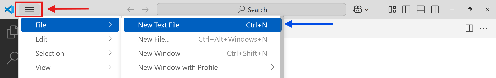

# Visual Studio Code

## Introducció

Instal·la VS Code amb l'instal·lador oficial que pots trobar en aquest enllaç: [Install VS Code on Windows](https://code.visualstudio.com/docs/setup/windows#_install-vs-code-on-windows).

La instal·lació afegeix Visual Studio Code a la variable d’entorn `%PATH%`, perquè puguis escriure `code .` a la consola i obrir VS Code en aquella carpeta.

## Interfície d’usuari

La interfície d’usuari (UI) de Visual Studio Code ofereix un disseny mínim i senzill que manté el codi font com a focus de l’entorn de desenvolupament. Quan inicies Visual Studio Code per primera vegada, mostra un disseny per defecte. A partir d’aleshores, cada vegada que l’obris, l’editor es recuperarà en el mateix estat en què es trobava en tancar-lo.

El primer que has de fer és posar la lletra a la mida que tu vulguis, igual que ho fas amb un navegador web:

|||
|----|----|
|<kbd>Ctrl</kbd> + <kbd>+</kbd>| Fa la lletra més gran |
|<kbd>Ctrl</kbd> + <kbd>+</kbd>| Fa la lletra més petita |

Pots sentir-te com a casa personalitzant el disseny al teu gust. Tanmateix, abans de començar a moure elements, convé conèixer les àrees principals de la UI i la seva funció respectiva.

### Activity Bar

La barra d’activitats, situada a l’extrem esquerre, et permet canviar entre vistes. Les vistes proporcionen accés ràpid a tasques comunes com les següents:

|  |  |
| --- | --- |
| Explorer | Gestió de fitxers i carpetes |
| Search | Cerca global i reemplaçament a través de carpetes obertes amb text pla o expressions regulars |
| Source Control | control de versions per mantenir repositoris de codi |
| Run | Funcions utilitzades durant la depuració, com variables, piles de crides i punts d’interrupció |
| Extensions | Navegació, instal·lació i gestió d’extensions des de l’Extension Marketplace |

A més de les vistes per defecte, la barra d’activitats també pot incloure vistes personalitzades proporcionades per extensions que instal·lis des de l’Extension Marketplace. Cada vista té una icona que reflecteix la seva funció.

Pots reordenar les vistes arrossegant-les i deixant-les anar a la barra d’activitats.
Les vistes també es poden amagar si fas clic amb el botó dret sobre la vista i selecciones Hide From Activity Bar. Les vistes formen part del teu disseny personalitzat, que es conserva cada vegada que executes Visual Studio Code.

### Side Bar

La barra lateral, situada a la dreta de la Barra d’activitats, mostra la vista activa. Si no hi ha cap vista seleccionada, la barra lateral es col·lapsa. Pots canviar la mida de la barra lateral fent clic i arrossegant la vora que comparteix amb l’editor. Les vistes per defecte de la barra lateral són Explorer, Search, Source Control, Run i Extensions.

### Editor

L’editor, que ocupa la major part de la pantalla, és on edites els fitxers. Pots canviar-ne la mida fent clic i arrossegant les vores que comparteix amb la barra lateral i els panells.

La zona superior de l’editor pot canviar en funció del tipus de fitxer que estigui actiu a l’editor.

### Panels

Els panells situats sota l’editor contenen una o més zones per a la sortida del programa, informació de depuració, errors i advertiments, i més. També pots arrossegar algunes de les vistes de la Barra d’activitats (com ara Search) a la zona de Panells.

També pots obrir el terminal integrat a la zona de Panells. El terminal integrat proporciona una interfície de línia d’ordres per al teu sistema operatiu.

Pots iniciar manualment un terminal amb la drecera de teclat <Keyboard id="Ctrl"/> + <Keyboard id="ñ"/>.

La disposició per defecte de Visual Studio Code inclou un terminal integrat obert a l’arrel del teu projecte.

### Status Bar

La barra d’estat, situada a la part inferior de la finestra de VS Code, conté informació sobre el projecte obert i els fitxers que edites. Algunes de les funcionalitats bàsiques de la barra d’estat inclouen:

- Gestió del control de versions amb Git
- Nombre total de problemes dels programes oberts (p. ex., variables no definides)
- Línia/columna
- Configuració del sagnat amb espais o tabuladors
- Configuració de la codificació
- Configuració de la seqüència de final de línia
- Mode de llenguatge
- Mecanisme d’enviament de comentaris de Visual Studio Code
- Notificacions

En fer clic a un element de la barra d’estat, s’executa una ordre o s’obre una finestra per modificar la configuració corresponent.

Les extensions que instal·lis des de l’Extension Marketplace poden afegir etiquetes addicionals a la barra d’estat per proporcionar accés ràpid a llançar ordres de l’extensió.

## Editor

### Crea un fitxer

Crea un fitxer des del menú d’opcions de VS Code, seleccionar __File__  > __New Text File__ (o la drecera <Keyboard id="Ctrl"/> + <Keyboard id="N"/>).

Escriu algún contingut al fitxer.

Si et fixes en la pestanya de dalt pots veure la pestanya de l'editor a canviant a un punt negre:

Això vol dir que les modificacions no s'han desat, __i si tanques l'editor__ els canvis es perdran.

Per desar el fitxer, selecciona __File__  > __Save__ (o la drecera <Keyboard id="Ctrl"/> + <Keyboard id="S"/>).

Pots veure que la pestanya de dalt ara té el nom del fitxer:

## Diversos fitxers

Pots tenir diversos fitxers i tenir-los oberts de manera simultània, cadascun en una pestanya diferent.

Crea un nou fitxer amb <Keyboard id="Ctrl"/> + <Keyboard id="N"/>

Per canviar entre fitxers oberts (o "pestanyes") ho pots fer de diverses maneres:

- Amb el ratolí pots seleccionar la pestanya del fitxer que necessites editar.

- També pots canviar entre pestanyes mitjançant les tecles <Keyboard id="Alt"/> + número (per exemple, <Keyboard id="Alt"/> + <Keyboard id="1"/>); cada número sol representar la posició relativa de la pestanya, cosa que facilita la navegació ràpida sense necessitat d’utilitzar el ratolí.

- També pots canviar entre pestanyes fent servir <Keyboard id="Ctrl"/> juntament amb les tecles <Keyboard id="AvPág"/> (avançar pàgina) i <Keyboard id="RePág"/> (retrocedir pàgina) del teclat.

Edita el contingut del nou fitxer que has creat i guarda'l amb <Keyboard id="Ctrl"/> + <Keyboard id="S"/>:

Si has modificat diversos fitxers i vols desar-los tots a la vegada, i ja han estat desats abans (o ja existien), ho fots fer seleccionant __File__  > __Save All__ (o la drecera <Keyboard id="Ctrl"/> + <Keyboard id="K"/>, <Keyboard id="S"/>).

Modifica el contingut dels dos fitxers que has creat i guarda'ls amb <Keyboard id="Ctrl"/> + <Keyboard id="K"/>+ <Keyboard id="S"/>.

### Tancar fitxers

Hi ha tres maneres diferents de tancar una pestanya:

- Amb el ratolí, pots prémer la creu de la pestanya (si no s’ha desat, apareixerà un diàleg per confirmar que es desin els canvis).
- També podem tancar la pestanya activa prement les tecles Ctrl + W.
- Pots tancar la pestanya activa prement les tecles Ctrl + F4.

__TODO__ Revisar subsecció a partir d'aquí

### Obrir fitxers

- Per obrir un fitxer emmagatzemat al disc, pots fer-ho seleccionant des del menú d’opcions: Fitxer -> Obrir fitxer.
- La drecera de tecles perquè aparegui el diàleg d’obertura de fitxer és Ctrl + O.

### Crea un altre fitxer a partir d’un d’existent

És habitual necessitar crear un fitxer nou basat en un d’existent. Per fer-ho, selecciona la pestanya del fitxer i després ves al menú d’opcions, tria Fitxer -> Anomena i desa. D’aquesta manera, pots crear un fitxer nou, per exemple, ‘pagina3.html’, mantenint el mateix contingut que el fitxer original, ‘pagina2.html’. Al quadre de diàleg que apareix, especifica el nou nom del fitxer, ‘pagina3.html’.

Una manera més ràpida de fer la mateixa acció és prémer les tecles Ctrl + Maj + S, que també obrirà el quadre de diàleg per desar el fitxer amb un nom nou.

### Desament automàtic

Per simplificar el procés de desar fitxers, pots habilitar la funció de «Desament automàtic». A Visual Studio Code, pots activar aquesta característica i oblidar-te d’haver de desar manualment. Ves al menú Fitxer -> Desament automàtic i marca l’opció. Si decideixes desactivar-la en el futur, simplement desmarca la casella.

Un cop activat, cada modificació que facis en un fitxer es desarà automàticament al disc on està emmagatzemat. Amb això, ja no caldrà utilitzar l’opció Fitxer -> Desar cada vegada que facis canvis

## Command Palette

Visual Studio Code proporciona accés a totes les comandes disponibles a través de la Paleta de comandes, i moltes d’aquestes comandes no estan disponibles mitjançant menús o altres elements de la interfície. Des de la Paleta de comandes, pots executar ordres per dur a terme tasques de l’editor, a més de comandes d’extensions.

Pots accedir a la Paleta de comandes amb la drecera de teclat <Keyboard id="Ctrl"/> + <Keyboard id="Maj"/> + <Keyboard id="P"/>.

Acostuma’t a aquesta drecera; la faràs servir molt amb Visual Studio Code!

Un cop oberta la Paleta de comandes, pots cercar comandes d’extensions escrivint unes quantes lletres del nom de l’extensió. A la llista que apareix, desplaça’t pels resultats fins que trobis la comanda que necessites; després, prem <Keyboard id="Enter"/>.

Desplaça’t per la Paleta de comandes per veure una llista completa de comandes. La majoria segueixen una convenció de noms del tipus _Funció/Extensió: Acció_.

Si hi ha una drecera de teclat configurada per a la comanda, aquesta es mostra a la dreta de la comanda. A mesura que utilitzis una comanda repetidament, apareixerà a la part superior de la Paleta de comandes com a comanda utilitzada recentment. Això et proporciona un accés ràpid a les comandes que fas servir amb més freqüència.

## Extensions

Pots ampliar la funcionalitat de Visual Studio Code instal·lant extensions des del Visual Studio Code Marketplace. Aquestes extensions estan creades tant per Microsoft com per la comunitat de desenvolupadors. Aquestes extensions afegeixen més funcionalitats, temes, eines i suport de llenguatges per al teu flux de treball de desenvolupament. Pots cercar extensions al Marketplace des de la vista Extensions.

<Aside>
També pots accedir al Visual Studio Code Marketplace mitjançant el navegador a [Extensions for Visual Studio Code](https://marketplace.visualstudio.com). Si decideixes instal·lar una extensió des del navegador, se’t demanarà obrir Visual Studio Code per completar la instal·lació.
</Aside>

A la vista Extensions, pots escriure directament a la barra de cerca per trobar una extensió. Els resultats de la cerca mostren el nom de l’extensió, la versió, una breu descripció i el nom del publicador. Quan selecciones una extensió dels resultats, l’editor mostra la pàgina de detalls de l’extensió.

Instal·les una extensió fent clic al botó Install a la pàgina de detalls de l’extensió.

Has canviat d’opinió i ja no la necessites? Pots desinstal·lar una extensió des de la mateixa pàgina de detalls fent clic a Uninstall.

El menú Més accions (és a dir, la icona dels tres punts situada a la part superior dreta de la vista Extensions) dona accés a totes les teves extensions instal·lades, recomanades, habilitades i deshabilitades. Si busques una nova extensió per donar suport al teu flux de treball, fes una ullada a les extensions recomanades. La vista Extensions proporciona recomanacions basades en fitxers oberts recentment així com en altres extensions instal·lades.

## Personalitzacions

Bàsicament, tots els elements i funcions de la interfície d’usuari de Visual Studio Code es poden personalitzar. Tot i que algunes personalitzacions són purament estètiques, un nombre important de personalitzacions poden convertir el teu entorn de desenvolupament en un espai accessible i productiu. Pots triar fer personalitzacions de manera global per a l’editor o per a un espai de treball específic. Una carpeta de projecte a Visual Studio Code es considera un espai de treball. L’espai de treball en si està format pels fitxers i carpetes dins del projecte.

__TODO__ Revisar

### Configuració

La configuració a Visual Studio Code es pot gestionar tant globalment com per espai de treball. La configuració global es gestiona dins de la configuració d’Usuari i s’aplica a qualsevol instància de Visual Studio Code que obris. La configuració de l’espai de treball només s’aplica quan s’obre un espai de treball i es pot compartir entre desenvolupadors d’un mateix projecte. La configuració de l’espai de treball també substitueix la configuració d’Usuari.

Pots gestionar la configuració d’Usuari i d’Espai de treball a l’editor de Configuració (premeu Cmd+,/Ctrl+, o selecciona Preferències ➪ Obre Configuració). A l’editor, la configuració es categoritza en els grups corresponents. Tota la configuració d’extensions es troba agrupada sota l’epígraf Extensions. La barra de cerca ofereix una manera ràpida de trobar la configuració que necessites.

## TODO

[Get the basics right!](https://microsoft.github.io/vscode-essentials/en/02-basics.html)