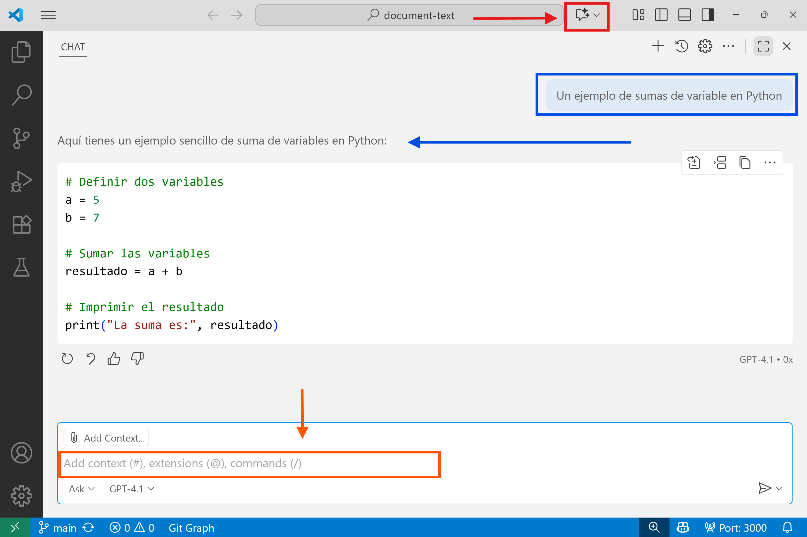

import {Keyboard, Page} from "@xtec/astro"

## Introducció

Abans de començar amb copilot mira com pots utilitzar la IA per aprendre a codificar: <Page id="learn/code"/>.

És molt important llegir-ho!!

També si vols la versió pro gratuïta et pots registrar com estudiant tal com s'explica a <Page id="project/github/copilot"/>.

Obre <Page id="project/vscode"/> i ... Som-hi 👻

Si no tens una subscripció a Copilot, pots registrar-te per utilitzar Copilot de franc directament des de dins de VS Code i obtenir un límit mensual de complecions i interaccions de xat.

## Chat

Pots utilitzar el xat en llenguatge natural de diverses maneres a VS Code, cadascuna optimitzada per a un cas d’ús i una tasca específics.

| Experiència | Cas d’ús |
| --- | --- |
| Chat view <br/> <Keyboard id="Ctrl"/> + <Keyboard id="Alt"/> + <Keyboard id="I"/> | Mantén una conversa de xat contínua i de diversos torns en una vista dedicada al lateral. Canvia entre diferents modes de xat per fer preguntes, aplicar edicions de codi a través de fitxers o iniciar un flux de treball de programació autònom. |
| Xat en línia
Inline chat <br/> <Keyboard id="Ctrl"/> + <Keyboard id="I"/> | Inicia una conversa de xat directament des de l’editor (xat en línia de l’editor) o el terminal integrat (xat en línia del terminal) per obtenir suggeriments in situ. |
| Quick Chat  <br/> <Keyboard id="Ctrl"/> + <Keyboard id="Majus"/> + <Keyboard id="L"/> | Fes una pregunta ràpida i torna al que estaves fent. |


Accedeix a cada experiència de xat mitjançant les dreceres de teclat corresponents o a través del menú Chat de la barra de títol de VS Code.

Pots utilitzar el chat de copilot per aprendre coses, per exemple pots preguntar a Copilot "Un ejemplo de sumas de variable en Python".

Si preguntes en català et respon en francès 😐.



Encara que la resposta molts cops no és la més encertada.

Per exemple, a <Page id="python/computation"/> has aprés a utilitzar els f-string:

```py
# Definir dos variables
a = 5
b = 7

# Sumar las variables
resultado = a + b

# Imprimir el resultado
print(f"La suma es {resultado}")
```

[Copilot Chat](https://code.visualstudio.com/docs/copilot/chat)

## Copilot Overview

[Copilot Overview](https://code.visualstudio.com/docs/copilot/overview)


