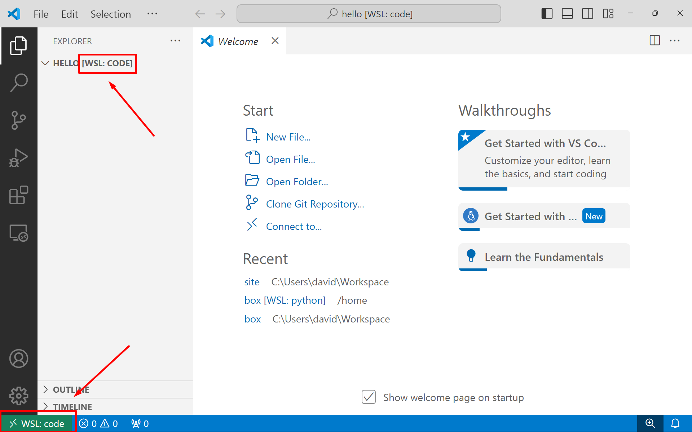
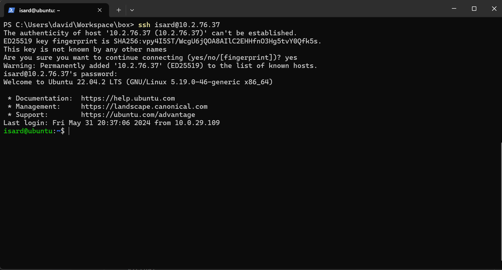
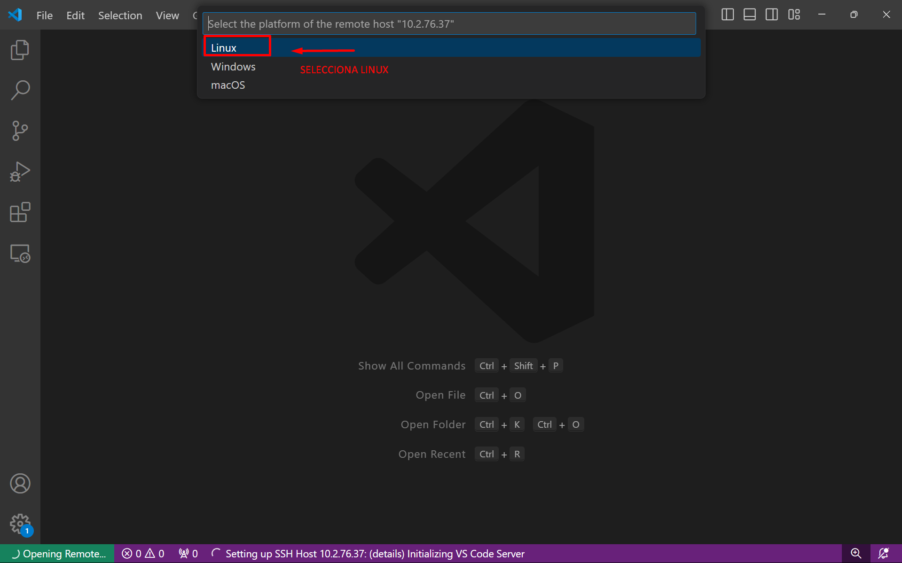
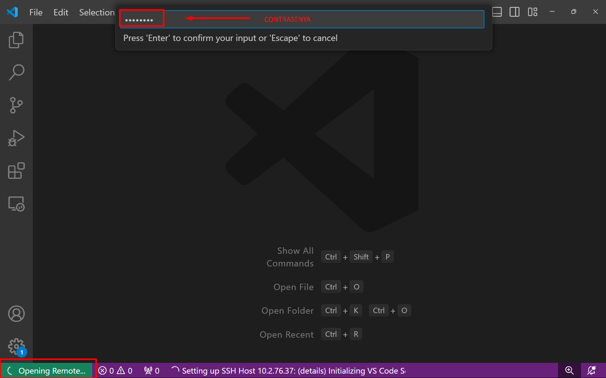
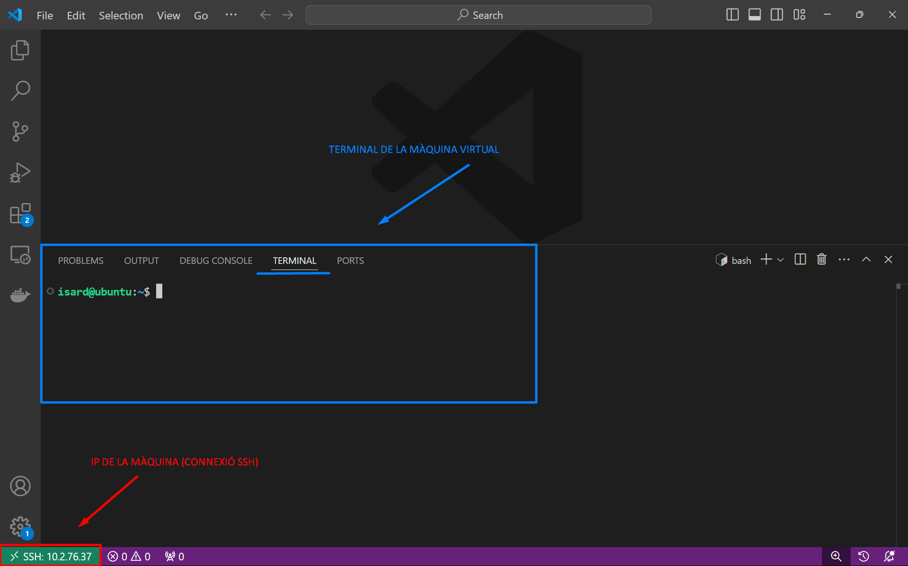

import {Keyboard, Page} from "@xtec/astro"

## WSL

Amb Visual Studio Code pots treballar de sde Windows amb una màquina WSL.

Crea una màquina Ubuntu tal com s'explica a: <Page id="windows/wsl"/>.

A continuació crea una carpeta `hello` i obre la carpeta `hello` amb `code`:

```sh
$ mkdir hello
$ code hello
Installing VS Code Server for Linux x64 (eaa41d57266683296de7d118f574d0c2652e1fc4)
Downloading: 100%
...
Compatibility check successful (0)
```

`code` instal.larà una extensió que permet al VSCode que s'executà al Windows comunicar-se amb la màquina virtual Linux.

D'aquesta manera pots treballar en un entorn Linux:



Pots veure que estas treballant amb una màquina WSL amb el nom de `code` perquè:

1. Al final de nom de la carpeta s'ha afegit `[WSL:Code`]
2. A la cantonada d'abaix a l'esquerra també s'ha afegit `[WSL:Code`]

Si obres un terminal, pots verificar que és el shell de la màquina virtual.

## SSH

Pots connectar VS Code amb una màquina remota.

**Important!** Aquesta activitat només es pot fer en un ordinador en què tinguis permisos d'administrador.

Això és útil perquè d'aquesta manera pots treballar amb una màquina més potent si el teu portatil no té gaire potència, o amb un Internet molt més ràpid que el de l'Institut.

Crea una màquina Ubuntu de 16 GB de RAM i 8 CPU s a <Page id="cloud/isard"/>, i configura el Windows perquè es pugui connectar a la xarxa Wireguard.

Verifica que et pots conectar per ssh a la IP de la màquina:




**TODO** Explicar com es crea la configuració ..

S’obrirà una nova finestra que et demana que seleccionis la plataforma de l'amfitrió remot.



Introdueix el "password" de la màquina virtual:



Ja estas connecta't a la màquina virtual:



Pots veure que:

* A baix de la finestra indica que estas treballant amb la màquina virtual

* Si obres un terminal aquest és en el shell de la màquina virtual.

Ja pots treballar amb la màquina virtual.

### Forward

**TODO** Falta explicar com es fa el forward per veure en el navegador una aplicació web.


## TODO

https://marketplace.visualstudio.com/items?itemName=ms-vscode-remote.vscode-remote-extensionpack